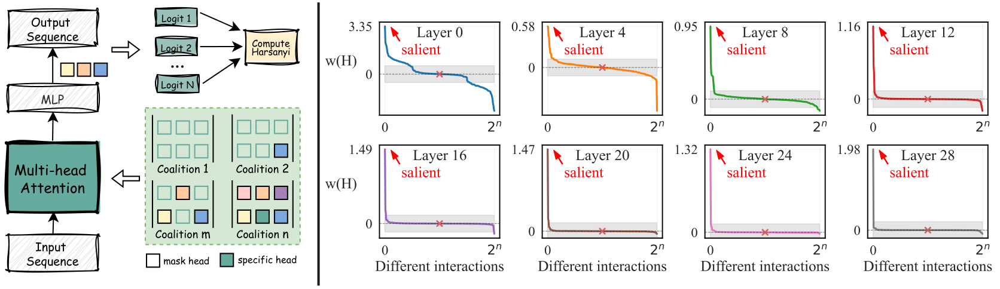

# Cooperative or Competitive? Understanding the Interaction between Attention Heads From A Game Theory Perspective

## Overview
Despite the remarkable success of attention-based large language models (LLMs), the precise interaction mechanisms between attention heads remain poorly understood.
In contrast to prevalent methods that focus on individual head contributions, we rigorously analyze the intricate interplay between attention heads by introducing a novel framework leveraging the Harsanyi dividend from cooperative game theory.
Our analysis reveals that significant positive Harsanyi dividends are sparsely distributed across head combinations, 
indicating that most heads do not contribute cooperatively. Moreover, certain head combinations exhibit negative dividends, indicating implicit competitive relationships. 
To further optimize the interactions among attention heads, 
we propose a training-free Game-theoretic Attention Calibration (GAC) method. 
Specifically, GAC selectively retains heads demonstrating significant cooperative gains and applies fine-grained distributional adjustments to the remaining heads.
Comprehensive experiments across 17 benchmarks demonstrate the effectiveness of our proposed GAC and its superior generalization capabilities across diverse model families, scales, and modalities.
Crucially, the discovered interaction phenomena offer a path toward a deeper understanding of the behaviors of LLMs.

<p align="center">
</img>
</p>

## Installation

Follow the steps below to set up the environment and install the necessary dependencies:

1. Create a new Conda environment:

```
conda create --name GAC python=3.9
conda activate GAC
```

2. Install required dependencies: Make sure you have pip installed, then run:

```
pip install -r requirements.txt
```

## Run GAC

### Step 1. For each layer, calculate the Harsanyi dividends between players.

The first step of our proposed GAC is to identify groups of attention heads that exhibit significant positive Harsanyi dividends.

#### 1.1 Classification Task 
Use the following command to perform this search process on classification datasets:

```
bash scripts/calibration_cf.sh
```

#### 1.2 Multiple Choice Task

Use the following command to perform this search process on multiple choice datasets:

```
bash scripts/calibration_mc.sh
```

#### 1.3 Question Answer Task
Use the following command to perform this search process on question answer datasets:

```
bash scripts/calibration_qa.sh
```

#### 1.4 POPE Task
Use the following command to perform this search process on MLLM's POPE datasets: 

```
bash scripts/calibration_pope.sh
```

### Step 2. Identify salient group.

After calculating the Harsanyi Dividend, we use the following command to select the salient group:

```
bash scripts/get_salient_group.sh [eval_task_type]
```

### Step 3. Evaluation

To alleviate the competition between attention heads that leads to negative Harsanyi dividends, we apply fine-grained distributional adjustments to the heads outside the salient group, thereby smoothing excessive attention weight allocations.

Use the following command to complete this process:

```
bash evaluation.sh [augmentations] [dataset_names] [model_type] [model_path] [eval_task_type]
```

## Directory Structure

Here is an overview of the key directories and files in this repository:

* llava:  Used to load the Llava Next series models
* model_aug:  Contains the core methods of our GAC
* modify_head_idx: The position where the salient group is defined.
* POPE: Question and answer pairs related to image and text data.
* transformers: Core code of the transformers library.
* utils: Defines methods for data loading.


## Datasets and Model

Here's where you can download datasets and model for our Experiment.

### Datasets

* [MSCOCO 2014 dataset](https://cocodataset.org/#home)
* [GQA dataset](https://cs.stanford.edu/people/dorarad/gqa/download.html)

### Models

* [Llama-3.1-8B-Instruct
](https://huggingface.co/meta-llama/Llama-3.1-8B-Instruct)
* [Qwen2.5-7B-Instruct
](https://huggingface.co/Qwen/Qwen2.5-7B-Instruct)
* [Qwen2.5-14B-Instruct](https://huggingface.co/Qwen/Qwen2.5-14B-Instruct)
* [Qwen2.5-32B-Instruct
](https://huggingface.co/Qwen/Qwen2.5-32B-Instruct)
* [llava-v1.6-mistral-7b-hf](https://huggingface.co/llava-hf/llava-v1.6-mistral-7b-hf)